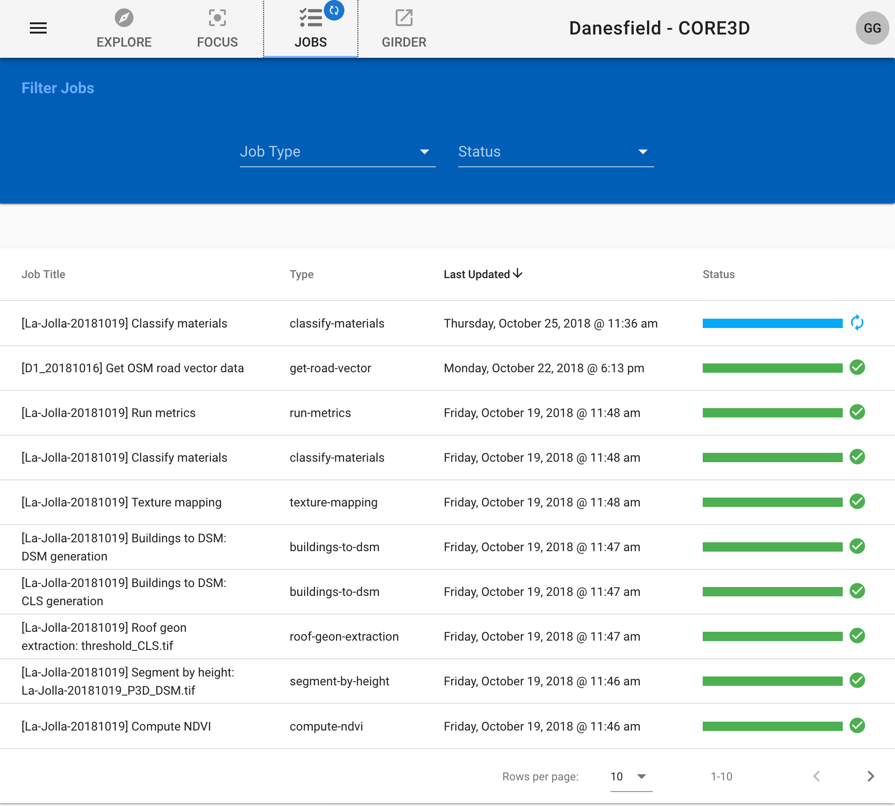

# Deprecation Notice

The Danesfield-App web application has been superseded by https://github.com/girder/Danesfield. This repo is deprecated, see the original README below.

# Danesfield App

The Danesfield App is a web application for running the [Danesfield](https://github.com/Kitware/Danesfield) algorithms and visualizing results.  Danesfield addresses the algorithmic challenges of the IARPA CORE3D program by reconstructing semantically meaningful 3D models of buildings and other man-made structures from satellite imagery.

## Video demo
<kbd></kbd>

## Screenshots
<kbd></kbd>

<kbd></kbd>

<kbd></kbd>

# Server

## Requirements

- [Conda](https://docs.conda.io/en/latest/)
- [Docker](https://www.docker.com/) ([docker-compose](https://docs.docker.com/compose/) also recommended)

## Setup

1. Run `conda/install.sh`. This will create and active a new conda environment, as well as install the required packages.
2. Pull the publicly available [Danesfield image](https://hub.docker.com/r/kitware/danesfield) on Docker Hub
3. Run `pip install -e server` to install girder and it's
4. (Optional) To setup girder with some default settings, you can run `python server/init_girder.py`. A default admin user and password are included in that script. If you would like to configure this, you can export the `GIRDER_ADMIN_USER` and `GIRDER_ADMIN_PASS` environment varibales before running the above command.


## Running dependent services/applicatons
Girder requires that [MongoDB](https://www.mongodb.com/) and [RabbitMQ](https://www.rabbitmq.com/) are running. If you've installed `docker-compose`, this can be done easily:

```
docker-compose up -d
```

You can stop these services by running `docker-compose stop`, and remove all associated data by runnning `docker-compose down`.

## Running the application/services
Run the following commands separately on the machine you wish to host the application on (within the conda environment):

1. `girder serve --host 0.0.0.0`
2. `python -m girder_worker -l info --concurrency 4`

Girder should now be running.

## Configuration

Models used:
1. [UNet Semantic Segmentation](https://github.com/Kitware/Danesfield/tree/master/tools#unet-semantic-segmentation)
2. [Building Segmentation](https://github.com/Kitware/Danesfield/tree/master/tools#columbia-building-segmentation)
3. [Material Classification](https://github.com/Kitware/Danesfield/tree/master/tools#material-classification)
4. [Roof Geon Extraction](https://github.com/Kitware/Danesfield/tree/master/tools#roof-geon-extraction)
5. [Run Metrics](https://github.com/Kitware/Danesfield/tree/master/tools#run-metrics)

Upload all [models](https://data.kitware.com/#collection/5fa1b59350a41e3d192de2d5/folder/5fa1b5e150a41e3d192de52b) to the `models` folder within the `core3d` collection, creating it if it doesn't exist.

# Client Setup
See [here](client/README.md)
